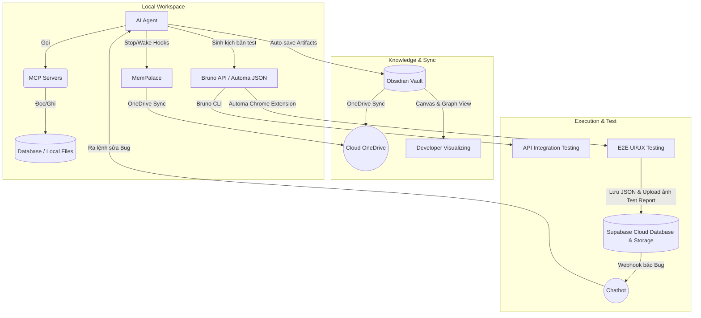
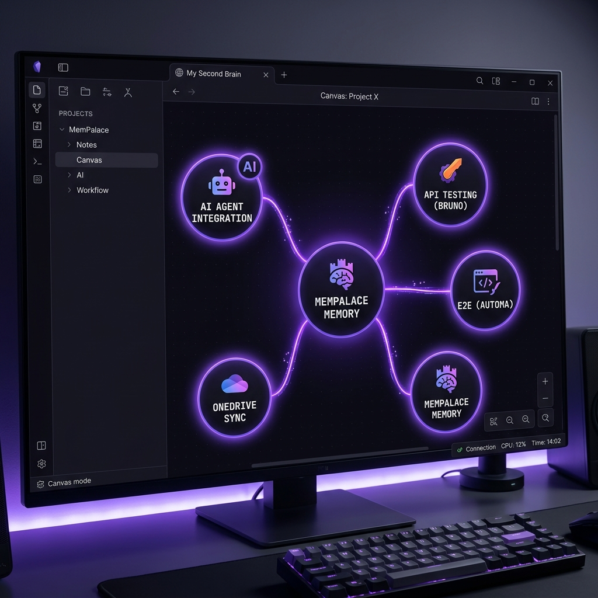
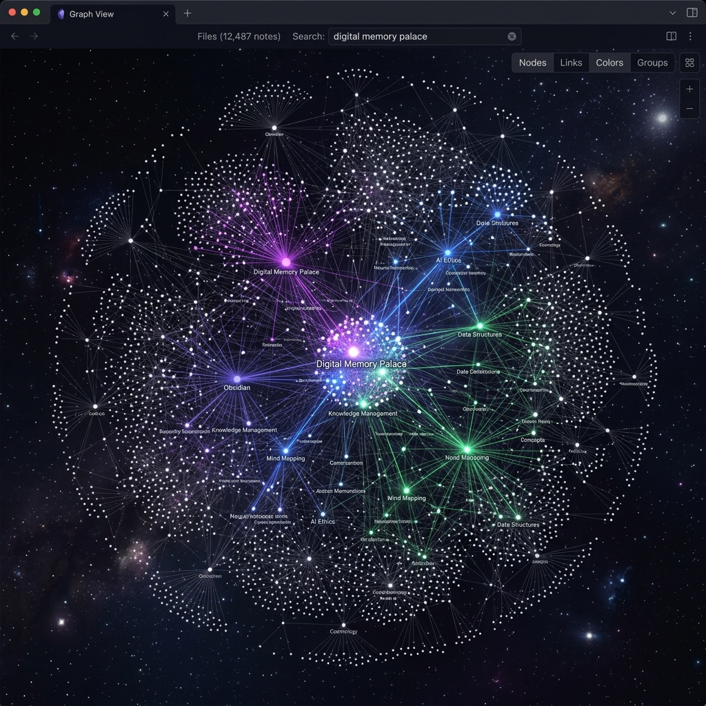

# Một Ngày Trong Đời Của Developer "Lười": Cách Tôi Dựng Siêu Hệ Thống Tự Động Hóa Với AI Agent, MemPalace & Obsidian

*Trải nghiệm thực tế từ những ngày tháng trăn trở để tối ưu hóa từng phút giây làm việc của tôi.*

Với tôi, nỗi ám ảnh lớn nhất mỗi ngày đi làm không phải là gặp bài toán khó, mà là những công việc lặp đi lặp lại vô nghĩa: cố gắng lục lọi trí nhớ xem hôm qua mình đang làm dở file nào, gõ đi gõ lại mấy câu lệnh terminal dài dằng dặc, mở Postman lên click click test API thủ công, hay cặm cụi click chuột giả lập trên trình duyệt để kiểm thử giao diện.

Tệ hơn nữa là khi tôi phải gánh vác và điều hành cùng lúc nhiều dự án khác nhau. Việc liên tục chuyển đổi bối cảnh (context switching) mà không có một phương pháp sắp xếp bộ nhớ khoa học rất dễ khiến đầu óc tôi rơi vào trạng thái quá tải (overhead) thông tin và kiệt quệ.

Chính vì vậy, là một người lười biếng một cách có tính toán, tôi đã quyết định đầu tư một lần để dựng lên một **hệ sinh thái tự động hóa** xoay quanh quy trình làm việc hàng ngày của mình. Hệ thống này kết hợp các công cụ: **AI Agent**, **[MemPalace](https://github.com/mempalace/mempalace) (Bộ nhớ dài hạn mã nguồn mở - Long-term Memory)**, **[Obsidian](https://obsidian.md/) (Quản lý tri thức dạng Graph local-first - Documentation / Knowledge Base)**, **OneDrive (Đồng bộ đám mây - Cloud Sync)**, **[Bruno](https://github.com/usebruno/bruno) (API Client mã nguồn mở thay thế Postman - API Testing)**, **MCP Server (Giao tiếp hệ thống - Model Context Protocol)**, **Automa (Tự động hóa trình duyệt - E2E Testing)** và **[Supabase](https://supabase.com/) (Dịch vụ Backend-as-a-Service mã nguồn mở cung cấp Database & Storage miễn phí)**.

Dưới đây là câu chuyện thực tế về cách các mảnh ghép này phối hợp nhịp nhàng với nhau trong một ngày làm việc của tôi để biến mọi thứ trở nên tự động và nhàn nhã.

## 📊 Ma Trận Lựa Chunk Công Cụ

Để xây dựng hệ thống này, các công cụ được tôi chọn lọc rất kỹ lưỡng dựa trên khả năng giao tiếp của chúng (hỗ trợ **MCP** để AI Agent gọi trực tiếp, tích hợp **CLI** để chạy dòng lệnh, hoặc khả năng **Scheduler** chạy tự động theo lịch). Dưới đây là bảng tổng hợp nhanh:

| Công cụ | Open Source | MCP | CLI / API | Scheduler | Lý do lựa chọn cốt lõi |
| :--- | :---: | :---: | :---: | :---: | :--- |
| **[MemPalace](https://github.com/mempalace/mempalace) (Memory)** | ✅ | ✅ | ✅ | ❌ | Cung cấp bộ nhớ dài hạn, cô lập bối cảnh (Context Isolation) theo từng dự án. |
| **[Obsidian](https://obsidian.md/) (Documentation)** | ❌ (Free) | ❌ | ✅ | ❌ | Quản lý tri thức local-first cực mạnh với Canvas và Graph View (hoặc có thể dùng **[Logseq](https://logseq.com/)** làm giải pháp mã nguồn mở thay thế). |
| **[Bruno](https://github.com/usebruno/bruno) (API Testing)** | ✅ | ❌ | ✅ | ✅ | Lưu request dạng file văn bản thuần. Hỗ trợ Environment Variables & scripts để test tự động API theo context/roles của user qua scheduler. |
| **[Automa](https://automa.site/) (E2E Testing)** | ✅ | ❌ | ✅ | ✅ | Tự động hóa trình duyệt qua giao diện trực quan, hỗ trợ export kịch bản JSON và chạy scheduler kiểm thử định kỳ. |
| **[Supabase](https://supabase.com/) (Database & Storage)** | ✅ | ✅ | ✅ | ❌ | Lưu trữ tập trung các kịch bản workflow JSON của Automa và cung cấp dịch vụ Storage **miễn phí** để lưu trữ hình ảnh test report của các lần chạy automation. |
| **MCP Servers (Integration)** | ✅ | ✅ | ❌ | ❌ | Cánh tay nối dài giúp trợ lý AI tương tác trực tiếp với Database, Figma, File System... |

*(Gợi ý: Nếu bạn muốn một hệ thống tài liệu hoàn toàn mã nguồn mở để thay thế cho Obsidian, [Logseq](https://logseq.com/) là một sự lựa chọn thay thế tuyệt vời với khả năng lưu trữ file markdown local-first và biểu đồ Graph View tương đương).*

---

## 🗺️ Sơ Đồ Kiến Trúc Hệ Thống

Để dễ hình dung cách các mảnh ghép này khớp vào nhau, hãy nhìn vào sơ đồ luồng hoạt động dưới đây:

---

## ⏰ Ký Sự Một Ngày Làm Việc Thực Tế

### 8:30 AM — Khởi động ngày mới với Obsidian (Documentation & Visualizing)

Bước vào bàn làm việc, tôi không mở VSCode ngay. Tôi mở **Obsidian** trước. 

Nhờ tính năng tự động đồng bộ qua OneDrive, toàn bộ các bản thiết kế, cấu trúc database và danh sách task của dự án từ hôm trước đã được cập nhật đầy đủ. Tôi mở **Obsidian Canvas** - nơi tôi vẽ sơ đồ tư duy của hệ thống. Nhìn vào các node kết nối trực quan, tôi biết chính xác luồng xử lý của module thanh toán (Billing Module) đang bị nghẽn ở đâu.

*(Ảnh minh họa) Giao diện Obsidian Canvas giúp tôi trực quan hóa luồng dữ liệu (Data flow) và bối cảnh dự án.*

Tôi chuyển sang **Graph View** để xem các mối liên kết giữa các file markdown tài liệu và code. Sự liên kết trực quan này giúp não bộ của tôi khởi động cực kỳ nhanh mà không cần mất 15-30 phút ngồi "nhớ lại" xem hôm qua mình đang làm dở cái gì.

*(Ảnh minh họa) Mạng lưới liên kết tài liệu số (Digital Mind Map) của tôi trên Obsidian Graph View.*

---

### 9:15 AM — Coding không cần gõ phím cùng AI Agent & MCP Servers (Local Dev Environment)

Tôi bắt đầu mở IDE để code. Người bạn đồng hành lúc này là một **AI Agent** chạy local cực kỳ mạnh mẽ. Nhưng để trợ lý này thực sự hiểu dự án, tôi đã cấu hình kỹ càng Workspace IDE của mình.

#### 💡 Mẹo mớm context chuẩn qua Workspace IDE
Thay vì để AI đoán mò cách chạy dự án, tôi chuẩn bị sẵn file `.vscode/tasks.json` và `.cursorrules` (hoặc file cấu hình tương đương).
*   **tasks.json:** Tôi định nghĩa sẵn các task chạy Maven, Docker hay npm script kèm theo chú thích chi tiết ở trường `"detail"`. Khi tôi bảo chạy dự án, AI tự động chui vào file cấu hình đọc và lấy đúng lệnh ra chạy.
*   **Mermaid Diagrams:** Tôi khuyên anh em nên cài extension Mermaid trong IDE. AI viết sơ đồ bằng chữ (Markdown) rất giỏi. Khi cần phân tích luồng code cũ rắc rối, tôi bắt AI: *"Hãy vẽ lại luồng này bằng Mermaid"*. Xem biểu đồ trực quan nhanh hơn đọc code chay nhiều lần.

Khi tôi ra lệnh: *"Kiểm tra schema bảng `transactions` hiện tại dưới DB local rồi viết hộ anh một API để xử lý hoàn tiền (refund) nhé."*

Lúc này, phép thuật của **MCP (Model Context Protocol) Server** hoạt động. Thay vì tôi phải đi tìm file SQL hay chụp cấu trúc bảng gửi cho AI, AI Agent tự động gọi công cụ của **Supabase/Postgres MCP Server** để truy vấn trực tiếp vào Database local của tôi. Nó tự đọc bảng, tự hiểu các cột, kiểu dữ liệu và sinh ra đoạn code API chuẩn xác 100% theo đúng coding convention của dự án.

---

### 10:30 AM — Cơ chế tự động "nạp ký ức" của MemPalace (Hooks & Plugins)

AI thông thường rất hay bị "mất não" (quên bối cảnh) sau khoảng 15-20 câu chat. Nhưng với hệ thống của tôi, **MemPalace** đóng vai trò là bộ nhớ dài hạn chạy local-first.

Mỗi khi tôi kết thúc một cuộc hội thoại với AI Agent, một **Stop Hook** (được cấu hình qua script chạy ngầm) tự động kích hoạt. Nó âm thầm bóc tách các quyết định quan trọng, cấu trúc code mới sửa và ném thẳng vào "lâu đài ký ức" MemPalace.

Đến chiều, khi tôi cần làm một task liên quan, **Wake Hook** của AI sẽ tự động query nhanh từ MemPalace: *"À, buổi sáng ông dev này đã sửa cấu trúc bảng transactions như thế này, quy tắc mã hóa chữ ký là thế kia..."* và bơm trực tiếp ngữ cảnh đó vào prompt tiếp theo. AI lập tức hiểu vấn đề mà tôi không cần phải tốn công giải thích lại từ đầu.

---

### 1:30 PM — Bruno (API Testing) - Tự động hóa kiểm thử luồng API theo Context/Roles

Sau khi code xong API refund, tôi cần test xem nó chạy đúng không. Thay vì mở Postman (vừa nặng vừa đòi đăng nhập cloud phiền phức), tôi dùng **Bruno**. 

Bruno cực kỳ đỉnh ở chỗ nó lưu các request dưới dạng các file markup có cấu trúc tương tự `*.yml` (với định dạng `.bru`). Điều này có nghĩa là tôi có thể vứt thẳng toàn bộ file cấu hình request này vào git repository. 

**Điểm cộng cực lớn ở đây:** Vì Bruno lưu trực tiếp thành các file `*.yml` / `*.bru` và tích hợp Git, nhóm phát triển (Dev) và nhóm kiểm thử (QC/QA) có thể làm việc song song hoàn toàn độc lập mà không lo bị block hay xung đột tài khoản cloud. Mỗi người tự viết kịch bản test cho role/context của mình, push lên git và chia sẻ nhanh chóng. 

Tôi bảo AI Agent: *"Em vào thư mục `api-tests/`, đọc các file `.bru` hiện tại rồi tạo cho anh một file test mới tên là `refund-api.bru` để test API vừa viết nhé."* 

AI viết file trong vòng 1 giây. Tôi chỉ cần chạy lệnh `bru run` ngay trên terminal để test tự động toàn bộ luồng API. Nhanh, gọn, nhẹ và hoàn toàn nằm trong tầm kiểm soát của Git.

---

### 3:00 PM — Automa (E2E Testing) & Supabase (Storage & DB) - Chạy Automation Test và Lưu Trữ Báo Cáo Miễn Phí

API đã chạy ngon, Frontend đã dựng xong, giờ đến phần kiểm thử luồng thanh toán -> xuất hóa đơn -> hoàn tiền trên trình duyệt. Thường thì chúng ta sẽ phải viết code Cypress hoặc Playwright khá tốn thời gian. Nhưng tôi chọn **Automa** - một Chrome Extension cho phép kéo thả để tạo kịch bản tự động hóa cực kỳ trực quan.

**Giải pháp độc lập và đồng bộ đám mây:** Vì Automa là một extension độc lập chạy trên trình duyệt, các nhóm test (QC) có thể tự thiết kế và xuất (export) kịch bản workflow dưới dạng các file `*.json`. Nhưng thay vì lưu trữ thủ công rời rạc, tôi tích hợp thêm **Supabase** vào làm máy chủ lưu trữ tập trung. 
*   Các file cấu hình `*.json` được lưu tập trung vào Supabase Database để AI Agent hoặc bất kỳ ai trong team đều có thể fetch về dùng ngay mà không bị block.
*   Khi Automa chạy test tự động, nó sẽ chụp ảnh màn hình các bước (Test Report Screenshots). Toàn bộ các ảnh này được tự động tải lên **Supabase Storage** (với gói **Miễn Phí** cực kỳ hào phóng lên tới 1GB lưu trữ). Mọi kết quả kiểm thử được công khai hóa bằng đường link CDN để cả Dev lẫn QC đều kiểm tra được ngay lập tức. 

Tuyệt chiêu ở đây là: Automa cho phép xuất kịch bản test dưới dạng file `*.json`. Tôi chỉ cần đưa file `*.json` mẫu của một luồng test cũ cho AI Agent và bảo: *"Hãy sửa đổi file `*.json` kịch bản Automa này để nó tự động điền form refund mới trên màn hình localhost:3000."*

AI sinh ra file `*.json` mới, tôi chỉ việc import vào Automa trên Chrome và nhấn Run. Trình duyệt tự động mở ra, click chuột, điền form, chụp màn hình lưu kết quả, đẩy thẳng ảnh lên Supabase Storage và hoàn tất báo cáo kiểm thử trong chớp mắt. Tôi chỉ ngồi uống nước và xem thành quả.

#### 🔔 Khi Bug xuất hiện: Tự động hóa qua Chatbot (Telegram / Teams / Slack)
Hệ thống này còn có một điểm cực kỳ vi diệu: Khi Automa chạy test định kỳ (scheduler) và phát hiện ra lỗi (assert fail hoặc crash giao diện), nó sẽ insert một bản ghi lỗi vào Supabase Database kèm link screenshot từ Storage. 

Ngay lập tức, một **Supabase Webhook** (được trigger từ sự kiện insert bảng lỗi) hoạt động. Nó tự động bắn thông tin chi tiết về Bug kèm ảnh chụp bằng chứng trực tiếp vào ứng dụng chat (nếu làm việc trong môi trường doanh nghiệp lớn, bạn hoàn toàn có thể sử dụng các nền tảng chat nhóm như **Microsoft Teams**, **Slack**, hoặc **Discord** thông qua cơ chế incoming/outgoing webhook tương tự, ở đây tôi cấu hình qua một Chatbot để dễ nhận diện thông báo). 

Điều thú vị nhất là tôi có thể gõ phản hồi trực tiếp trên ứng dụng chat (ví dụ như gõ `/fixbug [mô tả ngắn]`). Chatbot (được liên kết bằng API) sẽ dịch chuyển tin nhắn này thành lệnh và gửi trực tiếp về cho **AI Agent** đang chạy local. Agent tự động nhận lệnh, mở đúng file code bị lỗi ra sửa, chạy lại test và báo cáo ngược lại. Toàn bộ chu trình từ phát hiện lỗi đến sửa lỗi diễn ra khép kín và tự động kể cả khi tôi không ngồi trước máy tính.

---

### 5:00 PM — OneDrive (Cloud Sync) - Âm thầm đồng bộ và lưu trữ bối cảnh

Cuối ngày, tôi tổng hợp lại tài liệu thiết kế hệ thống và checklist công việc. Mỗi khi tôi lưu một tài liệu thiết kế dưới dạng markdown, AI Agent tự động kích hoạt luật đồng bộ, sao chép file đó vào thư mục **Obsidian Vault** nằm trong **OneDrive**.

**Tại sao tôi chọn OneDrive?** Đơn giản vì nó cực kỳ tiện dụng, đồng bộ nhanh, tích hợp sẵn trên hệ điều hành và hoàn toàn **miễn phí** (hoặc đi kèm gói Office 365 có sẵn của đại đa số dân văn phòng). Dữ liệu vừa an toàn vừa không tốn thêm một đồng chi phí bản quyền nào.

Đồng thời, thư mục lưu trữ dữ liệu local của **MemPalace** cũng được cấu hình nằm gọn trong thư mục OneDrive này. Hệ thống OneDrive âm thầm đồng bộ toàn bộ tài liệu thiết kế lẫn "kho ký ức" của AI lên đám mây. Tối về, tôi chỉ cần mở iPad hoặc máy tính cá nhân ở nhà lên, mở Obsidian là đã thấy toàn bộ tiến độ công việc, sơ đồ Canvas, Graph View được cập nhật mới nhất, và khi mở IDE ở nhà lên, trợ lý AI cũng tự động thừa hưởng toàn bộ ký ức làm việc của buổi chiều mà không bị đứt gãy mạch suy nghĩ.

---

## 💡 Lời Kết

Việc kết hợp nhiều công cụ nghe có vẻ phức tạp lúc ban đầu, nhưng khi đã cấu hình xong xuôi, bạn sẽ sở hữu một "trợ lý ảo" thực sự hiểu dự án của bạn từ Database, Codebase cho đến quy trình kiểm thử và tài liệu hóa.

*   **Lời khuyên:** Đừng cố gắng setup tất cả mọi thứ cùng một lúc. Hãy bắt đầu từ việc mớm context chuẩn qua IDE, sau đó tích hợp dần MemPalace để giữ bộ nhớ cho AI, rồi đến Bruno để quản lý API test bằng file text. Tự động hóa từng chút một, bạn sẽ thấy hiệu suất làm việc của mình tăng lên một cách đáng kinh ngạc!

Hy vọng những trải nghiệm thực tế này sẽ giúp bạn tìm ra giải pháp tối ưu cho chính mình để có được những giờ làm việc hiệu quả và nhàn nhã hơn!
